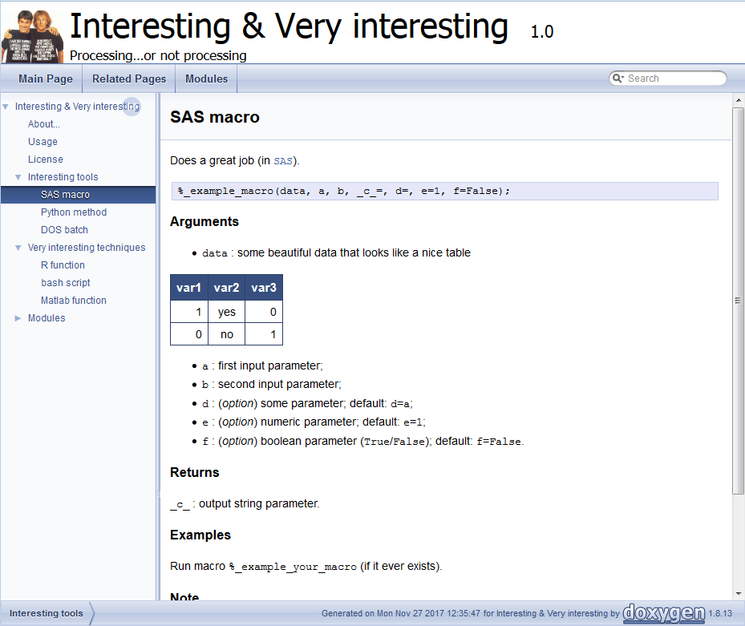

##### `doxy@ESTAT` Examples

We present below some examples of (artificial and actual) use of the script (whose usage is 
described [here](usage.md)), and also provide with all related help for the implementation.

###### Shared documentation of multiple languages

In the [`examples/`](https://github.com/gjacopo/bodylanguage/tree/master/doxy/examples)) 
folder, various dummy programs implemented in different programming languages are provided 
so as to illustrate the use of the common template, _e.g._ `SAS`, `R`, `Python`, _etc_... 
functions and scripts under the 
[`idir1/`](https://github.com/gjacopo/bodylanguage/tree/master/doxy/examples/idir1) and 
[`idir2/`](https://github.com/gjacopo/bodylanguage/tree/master/doxy/examples/idir2)
 directories are documented. The script 
[`src2mddoc.sh`](https://github.com/gjacopo/bodylanguage/blob/master/doxy/src2mddoc.sh) 
can be run to automatically extract the documentation from any of those files, _e.g._
the command:

	bash src2mddoc.sh -v -p -d examples/odir/md/process2/
		examples/idir1/_example_function.R

will extract the header documentation from the source file `_example_function.R` in 
`examples/idir1/` and store it as a new `markdown` file named `r__example_function.md` 
in the `examples/odir/md/process2/` directory.
The `ex_src2mddoc.sh` script will enable you to extract the header documentations from 
all available source files at once, _e.g._ run:

	bash examples/ex_src2mddoc.sh

so the output `markdown` files (one for each program) will be created in the (arbitrarily
selected) directories 
[`process1/`](https://github.com/gjacopo/bodylanguage/tree/master/doxy/examples/odir/md/process1/) 
and 
[`process2/`](https://github.com/gjacopo/bodylanguage/tree/master/doxy/examples/odir/md/process2/)
in `examples/odir/md/`.
Note also the presence of the 
[`_static_/`](https://github.com/gjacopo/bodylanguage/tree/master/doxy/examples/odir/md/_static_) 
directory in `examples/odir/md/` folder: it contains
static/ready-made `markdown` files that will actually define the structure/organisation of 
the final browsable documentation. They can be adapted/modified by the user; more can be added. 

Further, the document generator `Doxygen` is used to generate the `html` browsable 
documentation, _e.g._ run:

	bash examples/ex_mddoc2html.sh

since it essentially launches:

	doxygen examples/dox/doxygen-dumb-config.cfg

where the configuration file `doxygen-dumb-config.cfg` provides with different settings
for the output `html` documents (see the 
[configuration page](https://www.stack.nl/~dimitri/doxygen/manual/config.html) of 
`Doxygen` documentation). The final `html` browsable documentation is created under 
the folder 
[`examples/odir/html`](https://github.com/gjacopo/bodylanguage/tree/master/doxy/examples/odir/html) 
and can be launched from the `index.html` page. A preview is available in this 
[page](https://cdn.rawgit.com/gjacopo/bodylanguage/1d8d4738/doxy/examples/odir/html/index.html), 
however you will not be able to browse the whole documentation from there. 

<table>
<tr>
<td align="centre"><kbd> </kbd></td>
</tr>
<footer>
<td align="centre"><i>Shared documentation of various programming languages: in this example, 
the documentation of different stand-alone programs (implemented in <code>SAS</code>, 
<code>R</code>, <code>Python</code>, <code>Matlab</code>, etc...) is made available (and 
browsable) from a common (single-entry) webpage.</i></td>
</footer>
</table>

###### `PING` software documentation

The documentation of [`PING` software](https://github.com/gjacopo/PING) has been generated
automatically using this approach. It can be found [here](https://gjacopo.github.io/PING/).

The `markdown` files are again generated using the `src2mddoc.sh` script, _e.g._ run:

	bash src2mddoc.sh -v -p -d PING/docs/md/library/ 
		PING/library/pgm/*
		
so as to extract the documentation headers from all source files (whatever format) present 
in the input directory 
[`library/pgm`](https://github.com/gjacopo/PING/tree/master/library/pgm) and store the 
generated `markdown` files into the output directory 
[`docs/md/library`](https://github.com/gjacopo/PING/tree/master/docs/md/library) 
(no suffix, programming language added as prefix).

Following, the script 
[`ping2html.sh`](https://github.com/gjacopo/PING/blob/master/docs/bin/ping2html.sh) script 
is used (and further adapted) so as to generate automatically the final browsable `html` 
documentation, running the `Doxygen` inline command as follows:

	doxygen doxygen-ping-config.cfg
	
with the `doxygen`-formatted configuration file 
[doxygen-ping-config.cfg](https://github.com/gjacopo/bodylanguage/blob/master/doxy/examples/doxygen-ping-config.cfg).

<table>
<tr>
<td align="centre"><kbd> </kbd></td>
</tr>
<footer>
<td align="centre"><i>Statistical operations are documented regardless of the programming languages: 
in this example, the documentation of a quantile estimation is provided for both <code>SAS</code> 
and <code>R</code> implementations.</i></td>
</footer>
</table>
